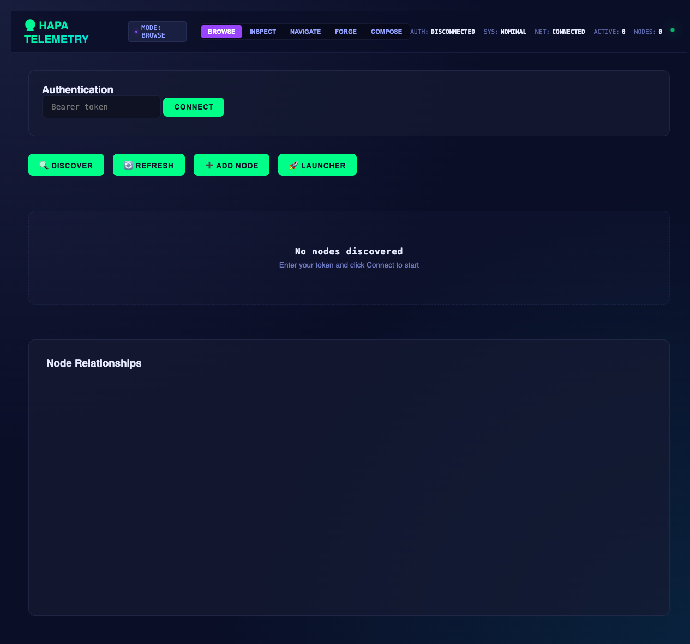

# Hapa Telemetry Node

Hapa Telemetry Node is the local-first observability, discovery, and Overwatch bridge service for the Hapa.ai node ecosystem.

Verified from this repository: it is a Python/FastAPI service with a small HTML dashboard, SQLite-backed node/telemetry state, a Click CLI, self-test harness, and pytest coverage for the Overwatch API surface. Its default local URL is `http://127.0.0.1:8730`.

Inferred ecosystem role: this node is the "lighthouse" or shared situational-awareness layer for Hapa nodes. It helps humans and agents see which local services exist, how to reach them, what they claim they can do, and where operational documentation lives.

## Hapa context

- Global wiki node page: `${HAPA_SYSTEM_ROOT}/canon/wiki/hapa-worldbuilding-wiki/SOURCE/Nodes/Existing/hapa-telemetry-node.md`
- Overwatch protocol reference: `${HAPA_SYSTEM_ROOT}/ops/overwatch/overwatch/SOURCE/protocols/TELEMETRY_PROTOCOL.md`
- Overwatch root used by default: `${HAPA_SYSTEM_ROOT}/ops/overwatch/overwatch/SOURCE`
- Project path: `${HAPA_NODE_ROOT}`

Connection opportunity: telemetry turns scattered local services into a shared map. That map increases trust because agents and humans can point at the same node list, health state, capability claims, and runbooks instead of relying on memory or folklore.

Pain signal addressed: without a telemetry hub, every integration repeats discovery, authentication, and "what is running?" questions. This node is the scaffold that converts that friction into queryable shared context.

## What it does

Verified capabilities in `hapa_telemetry_node/app.py`, `collector.py`, `discovery.py`, `registry.py`, and `overwatch_bridge.py`:

- Serves a dashboard at `/`.
- Exposes a public health check at `/health`.
- Requires bearer auth for most `/v1/*` endpoints.
- Registers itself as `telemetry-node` on startup.
- Discovers nodes using mDNS, port scanning, registry/manual registration paths.
- Polls known nodes for `/health`, `/v1/capabilities` or `/capabilities`, and `/v1/telemetry` when available.
- Stores node and telemetry state in SQLite.
- Builds a relationship graph for node status and dependencies.
- Provides Overwatch read/search endpoints and limited write scaffolds for task inbox entries, check-in/briefing stubs, and artifacts.
- Provides launcher/registry endpoints for known node definitions and instances.
- Includes `./hapa-telemetry` as a convenience wrapper that re-enters `.venv/bin/python` when present.

## Run commands

```bash
# Install dependencies into .venv
make install

# Start the service as a daemon
make start

# Check daemon/runtime status
make status

# Stop the daemon
make stop

# Run the built-in self-test against a running service
make test

# Discovery and graph helpers
make discover
make list
make graph

# Push current telemetry snapshots to Janus World Node
HAPA_JANUS_WORLD_NODE_TOKEN=... make janus-push
# Equivalent direct CLI
.venv/bin/python -m hapa_telemetry_node janus-push --janus-url http://127.0.0.1:8741 --janus-token ...
```

Equivalent direct CLI entrypoint:

```bash
./hapa-telemetry --help
./hapa-telemetry start --help
python -m hapa_telemetry_node --help
```

For app-level API tests that do not require a separately running daemon, point pytest at the `tests/` directory so the live-service helper functions in `hapa_telemetry_node/self_test.py` are not collected as standalone pytest tests:

```bash
.venv/bin/python -m pytest -q tests
```

## Ports, auth, and environment

Defaults verified from code:

- Host: `127.0.0.1`
- Port: `8730`
- Public endpoints: `GET /`, `GET /health`, and `POST /v1/telemetry/ping`
- Authenticated endpoints: most `/v1/*` APIs use `Authorization: Bearer <token>`
- Token source order: `HAPA_TELEMETRY_TOKEN`, then `.node_token`, then generated token saved to `.node_token`
- Runtime file: `artifacts/hapa-telemetry-node/runtime/telemetry_runtime.json`
- Default database path: `telemetry.db` unless overridden by code/env

Environment variables used by the service include:

- `HAPA_TELEMETRY_HOST` — bind host, default `127.0.0.1`
- `HAPA_TELEMETRY_PORT` — bind port, default `8730`
- `HAPA_TELEMETRY_TOKEN` — bearer token override
- `HAPA_TELEMETRY_SCAN_INTERVAL` — discovery interval, default `30`
- `HAPA_TELEMETRY_COLLECT_INTERVAL` — telemetry collection interval, default `10`
- `HAPA_TELEMETRY_DISABLE_BG_TASKS` — disable discovery/collection loops for tests
- `HAPA_TELEMETRY_DB_PATH` — test/runtime database override used by tests
- `HAPA_OVERWATCH_ROOT` or `OVERWATCH_ROOT` — override Overwatch root
- `HAPA_REGISTRY_PATH` and `HAPA_LAUNCHER_LOG_DIR` — registry/launcher integration paths
- `HAPA_TELEMETRY_JANUS_BRIDGE_ENABLED` — opt-in periodic Telemetry → Janus snapshot bridge, default disabled
- `HAPA_JANUS_WORLD_NODE_BASE_URL` — Janus bridge target, default `http://127.0.0.1:8741`
- `HAPA_JANUS_WORLD_NODE_TOKEN` or `HAPA_JANUS_TOKEN` — bearer token used by the Janus bridge
- `HAPA_TELEMETRY_JANUS_BRIDGE_INTERVAL` — periodic Janus bridge interval, default `30`

Do not commit `.node_token`, `telemetry.db`, runtime artifacts, generated self-test result JSON, or `.venv`.

## API surface

Public:

- `GET /` — dashboard UI from `web/index.html`
- `GET /health` — health and monitored-node count
- `POST /v1/telemetry/ping` — ping/update endpoint for telemetry clients

Authenticated Hapa node APIs:

- `GET /v1/capabilities`
- `GET /v1/nodes`
- `GET /v1/nodes/{node_id}`
- `DELETE /v1/nodes/{node_id}`
- `GET /v1/telemetry`
- `GET /v1/telemetry/{node_id}`
- `POST /v1/discovery/register`
- `POST /v1/discovery/scan`
- `GET /v1/graph`
- `POST /v1/bridges/janus/push` — one-shot push of current Telemetry node snapshots into Janus World Node; also exposed in the dashboard as the Janus Snapshot Bridge panel

Repository-local agent/protocol context lives in `AGENTS.md`. Keep API, CLI, UI, tests, `README.md`, and `docs/FEATURE_PARITY.md` aligned for operator-facing changes.

Authenticated Overwatch bridge APIs include:

- `GET /v1/overwatch/health`
- `GET /v1/overwatch/docs`
- `GET /v1/overwatch/docs/{doc_id}`
- `GET /v1/overwatch/status_board`
- `GET /v1/overwatch/task_inbox`
- `GET /v1/overwatch/search`
- `GET /v1/overwatch/fs/ls`
- `GET /v1/overwatch/fs/read`
- `GET /v1/overwatch/search_tree`
- `GET /v1/overwatch/summary`
- `GET /v1/overwatch/activity`
- `GET /v1/overwatch/protocol_scorecards`
- `POST /v1/overwatch/chat`
- `GET /v1/overwatch/write/capabilities`
- `POST /v1/overwatch/write/task_inbox`
- `POST /v1/overwatch/write/check_in_stub`
- `POST /v1/overwatch/write/briefing_stub`
- `POST /v1/overwatch/write/artifact`

Authenticated registry/launcher APIs include:

- `GET /v1/registry/nodes`
- `POST /v1/registry/nodes`
- `GET /v1/registry/nodes/{node_type}`
- `POST /v1/launcher/start`
- `POST /v1/launcher/stop`
- `GET /v1/launcher/instances`
- `GET /v1/launcher/instances/{instance_id}`
- `GET /v1/launcher/instances/{instance_id}/logs`

## Data inputs and outputs

Inputs:

- Node registrations posted to `/v1/discovery/register`
- Health/capability/telemetry responses from discovered nodes
- Overwatch markdown/JSON documents under the configured Overwatch root
- Registry JSON and launcher logs when configured

Outputs:

- Dashboard HTML for operator visibility
- JSON responses for node discovery, telemetry, graph, Overwatch, registry, and launcher queries
- SQLite state in `telemetry.db`
- Runtime metadata under `artifacts/hapa-telemetry-node/runtime/`
- Self-test result JSON under `artifacts/hapa-telemetry-node/runs/self_test/`
- Optional Overwatch writes through guarded write endpoints
- Optional Janus World Node writes of truth-safe node snapshots through `POST /v1/world/node-snapshots`

## Node integration contract

Minimum for discoverability:

```python
@app.get("/health")
def health():
    return {"status": "healthy"}
```

Recommended:

```python
@app.get("/v1/capabilities")
def capabilities():
    return {
        "service": "your-node",
        "api_version": "1.0.0",
        "node_id": "your-node-id",
        "supported_operations": ["health", "telemetry"]
    }

@app.get("/v1/telemetry")
def telemetry():
    return {
        "status": "online",
        "metrics": {"cpu_percent": 0.0},
        "relationships": {"depends_on": [], "provides_to": []}
    }
```

## Repository layout

```text
hapa-telemetry-node/
├── hapa_telemetry_node/
│   ├── app.py              # FastAPI application and routes
│   ├── auth.py             # bearer-token loading/verification
│   ├── cli.py              # Click CLI
│   ├── collector.py        # telemetry polling
│   ├── database.py         # SQLite storage
│   ├── discovery.py        # mDNS/port/registry discovery
│   ├── janus_bridge.py     # optional Telemetry → Janus node snapshot bridge
│   ├── models.py           # Pydantic models
│   ├── overwatch_bridge.py # Overwatch document/search/write bridge
│   ├── registry.py         # registry and launcher support
│   └── self_test.py        # live-service self-test harness
├── tests/
│   ├── test_janus_bridge.py
│   └── test_overwatch_api.py
├── web/
│   └── index.html
├── hapa-telemetry          # executable wrapper
├── Makefile
├── requirements.txt
├── CAMPFIRE.md
├── LICENSE
└── README.md
```

## Verification status

This documentation sweep should not be read as a claim that the daemon is currently running. Treat runtime status as live-only and verify with:

```bash
make status
curl http://127.0.0.1:8730/health
.venv/bin/python -m pytest -q tests
```

## License

Project-level license: MIT under Hapa.ai / Calder Wong. See `LICENSE`.

Bananas attribution option: contributors may opt into Bananas work-contribution tracking for attribution, provenance, and recognition. Bananas attribution is optional and does not replace the MIT license terms.

Third-party dependencies keep their own licenses and notices. Do not remove or rewrite third-party license files inside dependency directories or vendored assets.

<!-- HAPA-README-SCREENSHOT-2026-05-22 -->

## Screenshot



Hapa Telemetry dashboard browse mode.


<!-- HAPA-README-QUALITY-PASS-2026-05-22 -->

## Hapa ecosystem context


### Shared ecosystem pattern

Hapa is built as a constellation of modular nodes. Each node owns a focused capability, but participates in a shared protocol for provenance, handoff, cards, memory, and operations.

Every node is designed for both human operators and AI agents. The target contract is three surfaces: a UI for direct human review/control, an API for node-to-node and agent calls, and a CLI for scripted runs, audits, and handoffs. Individual repos may be at different maturity levels, but the public contract is that humans and agents can inspect, operate, and verify the node.

Hapa nodes power AI agents and avatar-agents that build new nodes and enhance existing ones. As work moves through the ecosystem, it is mined for utility, wisdom, and repeatable logic, then distilled into Hapa Cards: portable packets of skills, context, memories, and operational patterns.

Humans and AIs use Hapa Cards to discuss, ideate, prototype, and deploy increasingly complex workflows through a playable, card-collecting mechanic. Collaboration history, skills, work artifacts, and canonical decisions are stored in [hapa-second-brain](https://github.com/calderwong/hapa-second-brain), enriched into [Hapa Worldbuilding Wiki](https://github.com/calderwong/hapa-worldbuilding-wiki) entries, and converted back into cards. Avatar-agents can also be combined or specialized into purpose-built identities with their own storage, lore, canon, card decks, skills, and protocols.

### Purpose

Discovery and monitoring hub that tracks Hapa node health, capabilities, launchers, and ecosystem relationships.

### Current status

- Status: **active telemetry/discovery node**.
- Local source root: `${HAPA_NODE_ROOT}`.
- This README is intended to be useful to both human operators and future agents: it should explain what the node is for, what it consumes, what it emits, how it connects to other Hapa nodes, and what should stay out of git.

### Inputs

- Node registry definitions, health/capability endpoints, bearer tokens, launcher requests

### Outputs

- Node status dashboard, capability maps, launch/health telemetry, and registry snapshots

### Interfaces

- Node/Fastify-style service
- Browser telemetry dashboard
- Registry and launcher modules

### Related Hapa nodes

- [Hapa AG / Dev Proto](https://github.com/calderwong/hapa-dev-proto-private) — Primary local-first app; many nodes feed it cards, assets, chat, debug, or projection data.
- [Hapa Worldbuilding Wiki](https://github.com/calderwong/hapa-worldbuilding-wiki) — Canonical Markdown graph for lore, nodes, names, cards, systems, and provenance.
- [Overwatch](https://github.com/calderwong/overwatch) — Operations map: inventory, source index, task inbox, protocols, and runbooks.
- [Hapa Keys Node](https://github.com/calderwong/hapa-keys-node) — Local key vault used by authenticated nodes and tools.
- [Hapa Lore Node](https://github.com/calderwong/hapa-lore-node) — Chronicle/canon service for daily progress, lore, and searchable wisdom.
- [Hapa Anvil Node](https://github.com/calderwong/hapa-anvil-node) — Card standardization/evaluation/forge node for turning raw card ideas into usable artifacts.
- [Hapa Janus World Node](https://github.com/calderwong/hapa-janus-world-node) — World-state truth kernel and event tape for Janus/desktop simulation work.
- [Hapa MLX Station](https://github.com/calderwong/hapa-mlx-station) — Apple Silicon media-generation station that produces visual/audio assets for cards, wiki, and production runs.
- [Hapa Lance Node](https://github.com/calderwong/hapa-lance-node) — Local indexing/projection layer for cards, wiki chunks, embeddings, and multimodal records.

### Operating contract

- Treat generated media, local databases, model weights, dependency folders, build outputs, app bundles, and secrets as runtime artifacts unless this README explicitly says otherwise.
- Prefer loopback/local operation first; expose network services only with explicit auth and operator intent.
- When this node produces artifacts for another node, record enough provenance for the receiving node or wiki page to recover the source path, command, prompt, or API request.
- Keep `README.md`, `LICENSE`, `NOTICE.md` where applicable, and repo-local screenshots current as the node evolves.
